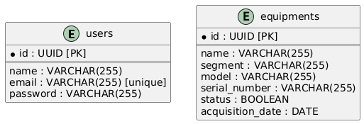

# Sistema de Gerenciamento de Equipamentos de TI  

> "A arquitetura de software é o alicerce sobre o qual grandes sistemas são construídos; negligenciá-la é construir sobre areia." — Grady Booch  

    

**Olá, Dev!**  

Este é um projeto backend desenvolvido em **Node.js** com o framework **Express**, utilizando **MongoDB** como banco de dados. O sistema tem como objetivo simplificar o gerenciamento dos equipamentos de TI, facilitando o cadastro, atualização, exclusão e visualização dos dados de forma organizada.  

---

## Como o projeto funciona?

### Diagrama Entidade-Relacionamento



### Diagrama de Caso de Uso


---

## Pré-Requisitos  

### Backend  

- Node.js (versão 23.x)  
    - Como instalar?  
        - Instalação manual: [baixar](https://nodejs.org/)  
- MongoDB (versão 6.x)  
    - Como instalar?  
        - Instalação manual: [baixar](https://www.mongodb.com/try/download/community)  
- Um editor de código, como **VSCode**  
    - Como instalar?  
        - Instalação manual: [baixar](https://code.visualstudio.com/)  

---

## Ambiente de Desenvolvimento  

### Configuração do Backend  

1. **Instale as Dependências**  
    - Instale as dependências do projeto:  

    ```bash  
    npm install  
    ```  

2. **Inicie o Servidor**  
    - Inicie o servidor de desenvolvimento:  

    ```bash  
    npm run dev  
    ```  

    - O backend estará disponível em [localhost:8080](http://localhost:8080).  

3. **Acesse a API**  
    - Utilize ferramentas como **Postman** ou **Insomnia** para testar os endpoints da API.  

---

### Onde obter ajuda?

Para sanar quaisquer dúvidas, procure o Engenheiro de Software responsável pelo projeto.